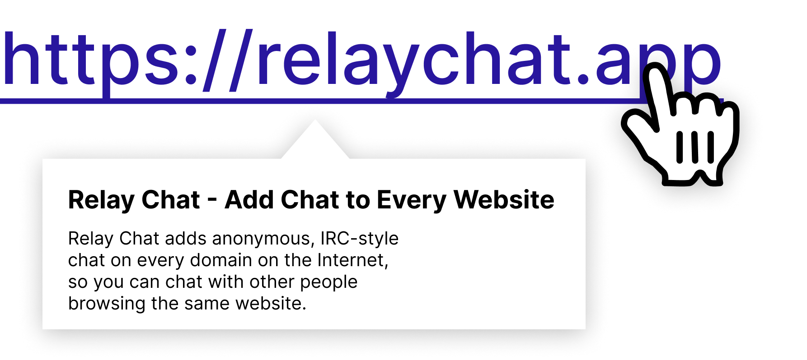

# react-link-previewer :mag_right:

[](https://www.npmjs.com/package/react-link-previewer) [](https://www.npmjs.com/package/react-link-previewer) [](https://github.com/relay-chat/react-link-previewer/blob/master/LICENSE) [](https://www.npmjs.com/package/react-link-previewer)

Preview links with page meta tags using React component / hook + [Go service](https://github.com/talentlessguy/og-service/).

## Features

- ⚡ Client-side and server-side support
- 🛠️ Hook and component are written in TypeScript
- 🚀 Fast standalone service (written in Go)

## Docs

Docs with examples and advanced usage are [here](https://react-link-previewer.now.sh/).

## Example

Here's a basic usage example (for more see [docs](https://react-link-previewer.now.sh/)):

```jsx
import React from 'react'
import { LinkPreview } from 'react-link-previewer'

function App() {
  return <LinkPreview link="https://relaychat.app">RelayChat</LinkPreview>
}

export default App
```

## Installation

```sh
# yarn
yarn add react-link-previewer
# npm
npm i react-link-previewer
# pnpm
pnpm i react-link-previewer
```

## Folks using react-link-previewer

- [RelayChat](https://relaychat.app/)

## Author

[v1rtl](https://v1rtl.site)
