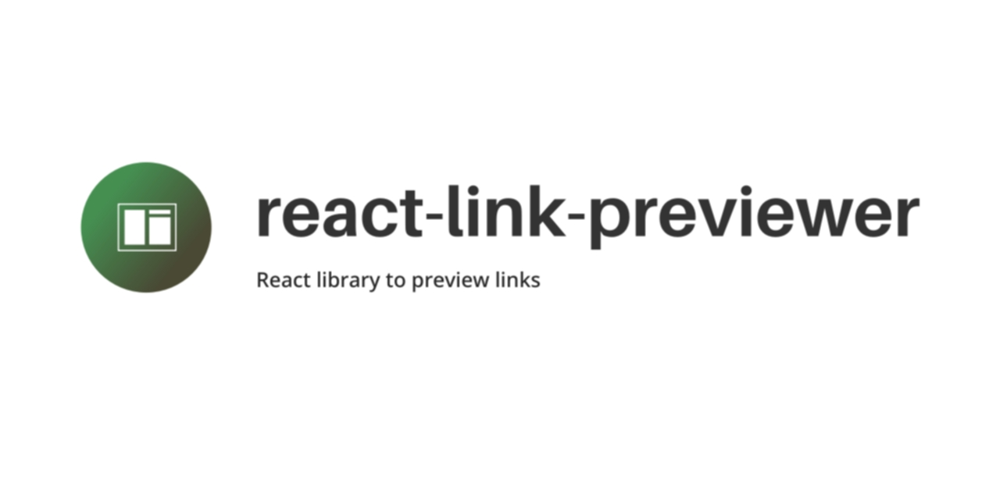

# react-link-previewer ⚡

React library to preview links.

## Features

- ⚡ Client-side and server-side support
- 🛠️ Hook and component are written in TypeScript
- 🚀 Fast standalone service (written in Go)

## Frontend

### Installation

```sh
# yarn
yarn add react-link-previewer
# npm
npm i react-link-previewer
# pnpm
pnpm i react-link-previewer
```

### How the frontend works

The hook makes a request to a service (which is pre-deployed but you can set your own) and passes `link` (the link you want to preview, e.g. `https://dev.to`) as a query parameter, so we get a link looking like this:

```js
const url = `${host}?link=${link}`
```

Then the returned data, which we requested from the service, is passed to children so you can use it to preview your link.

### Hook Options

The hook takes `ReactLinkPreviewProps` parameters:

- `host?` - optional custom service url
- `link` - link that you want to preview
- `fetchOptions?` - optional `fetch` paramaters for making the request

## Backend service

Backend service with installation and usage example is in [this repo](https://github.com/talentlessguy/og-service/).

## Author

[v1rtl](https://v1rtl.site)
